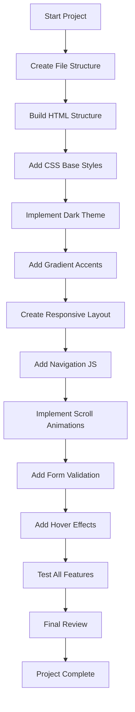

# Automation Agency Website Clone - Development Plan

## Project Overview
A modern agency landing page clone inspired by automationagency.com, built with HTML, CSS, and JavaScript. The website features a dark theme with gradient accents, smooth animations, and a fully responsive design.

---

## Project Structure

```
Clone-Django/
├── index.html          # Main HTML file
├── css/
│   └── styles.css      # All CSS styles
├── js/
│   └── main.js         # JavaScript functionality
└── assets/
    └── images/         # Image assets (if needed)
```

---

## Website Sections

### 1. Navigation Bar
- **Sticky/Fixed position** - stays at top while scrolling
- **Logo** on the left
- **Navigation links** on the right: Home, Services, About, Testimonials, Contact
- **Mobile hamburger menu** for responsive design
- **Glassmorphism effect** with blur background when scrolled

### 2. Hero Section
- **Large headline** with gradient text effect
- **Subheadline** describing the agency
- **Call-to-action button** with hover animation
- **Background** with gradient mesh or animated particles
- **Optional hero image/illustration**

### 3. Services Section
- **Section title** with gradient underline
- **Service cards** in a grid layout (3-4 columns)
- Each card includes:
  - Icon (using Font Awesome or SVG)
  - Service title
  - Brief description
- **Hover effects** - scale, shadow, gradient border

### 4. About Section
- **Two-column layout** - image on left, content on right
- **Company story/mission**
- **Key statistics** with animated counters
- **Gradient accent elements**

### 5. Testimonials Section
- **Carousel/slider** or grid layout
- Each testimonial card:
  - Client photo
  - Client name and company
  - Testimonial text
  - Star rating
- **Navigation dots** or arrows for carousel

### 6. Contact Section
- **Two-column layout** - contact info and form
- Contact form fields:
  - Name (text input)
  - Email (email input)
  - Subject (text input)
  - Message (textarea)
  - Submit button with loading state
- **Form validation** - real-time validation with error messages
- **Success message** after submission

### 7. Footer
- **Logo and brief description**
- **Quick links** - navigation links
- **Social media icons**
- **Copyright text**

---

## Design Specifications

### Color Palette
```css
/* Dark Theme Colors */
--bg-primary: #0a0a0f;
--bg-secondary: #12121a;
--bg-tertiary: #1a1a25;

/* Gradient Accents */
--gradient-primary: linear-gradient(135deg, #667eea 0%, #764ba2 100%);
--gradient-secondary: linear-gradient(135deg, #f093fb 0%, #f5576c 100%);
--gradient-accent: linear-gradient(135deg, #4facfe 0%, #00f2fe 100%);

/* Text Colors */
--text-primary: #ffffff;
--text-secondary: #a0a0b0;
--text-muted: #6b6b7b;

/* Accent Colors */
--accent-purple: #667eea;
--accent-pink: #f5576c;
--accent-blue: #4facfe;
```

### Typography
- **Primary Font**: Inter or Poppins (Google Fonts)
- **Headings**: Bold weight, larger sizes
- **Body**: Regular weight, 16px base size
- **Line height**: 1.6 for readability

### Spacing
- **Section padding**: 80px - 120px vertical
- **Container max-width**: 1200px
- **Card padding**: 30px
- **Grid gap**: 30px

---

## Animations & Effects

### Scroll Animations
- **Fade-in-up** - elements fade in and slide up when entering viewport
- **Stagger effect** - cards animate sequentially
- **Counter animation** - numbers count up when visible

### Hover Effects
- **Buttons** - scale up, gradient shift, glow effect
- **Cards** - lift up, shadow increase, gradient border
- **Links** - underline animation, color change
- **Images** - slight zoom, overlay

### Navigation Effects
- **Glassmorphism** when scrolled
- **Active link indicator** with gradient underline
- **Mobile menu** slide-in animation

---

## Responsive Breakpoints

```css
/* Desktop */
@media (min-width: 1200px) { }

/* Tablet Landscape */
@media (max-width: 1199px) { }

/* Tablet Portrait */
@media (max-width: 991px) { }

/* Mobile Landscape */
@media (max-width: 767px) { }

/* Mobile Portrait */
@media (max-width: 479px) { }
```

---

## JavaScript Functionality

### 1. Sticky Navigation
```javascript
// Add/remove class on scroll for glassmorphism effect
window.addEventListener('scroll', () => {
  const nav = document.querySelector('nav');
  nav.classList.toggle('scrolled', window.scrollY > 50);
});
```

### 2. Mobile Menu Toggle
```javascript
// Hamburger menu toggle for mobile
const menuToggle = document.querySelector('.menu-toggle');
const navLinks = document.querySelector('.nav-links');
menuToggle.addEventListener('click', () => {
  navLinks.classList.toggle('active');
});
```

### 3. Scroll Animations
```javascript
// Intersection Observer for fade-in animations
const observer = new IntersectionObserver((entries) => {
  entries.forEach(entry => {
    if (entry.isIntersecting) {
      entry.target.classList.add('visible');
    }
  });
}, { threshold: 0.1 });
```

### 4. Form Validation
```javascript
// Real-time form validation
const form = document.getElementById('contact-form');
form.addEventListener('submit', (e) => {
  e.preventDefault();
  // Validate fields and show errors
  // Submit form if valid
});
```

### 5. Smooth Scroll
```javascript
// Smooth scroll to sections
document.querySelectorAll('a[href^="#"]').forEach(anchor => {
  anchor.addEventListener('click', smoothScroll);
});
```

### 6. Counter Animation
```javascript
// Animate numbers when visible
function animateCounter(element, target) {
  let current = 0;
  const increment = target / 100;
  // Animate counting
}
```

---

## Implementation Flow Diagram



---

## File Checklist

### HTML (index.html)
- [ ] DOCTYPE and meta tags
- [ ] Google Fonts link
- [ ] Font Awesome CDN
- [ ] CSS file link
- [ ] Navigation section
- [ ] Hero section
- [ ] Services section
- [ ] About section
- [ ] Testimonials section
- [ ] Contact section
- [ ] Footer section
- [ ] JavaScript file link

### CSS (css/styles.css)
- [ ] CSS Reset/Normalize
- [ ] CSS Variables for colors
- [ ] Typography styles
- [ ] Navigation styles
- [ ] Hero section styles
- [ ] Services grid styles
- [ ] About section styles
- [ ] Testimonials styles
- [ ] Contact form styles
- [ ] Footer styles
- [ ] Animation keyframes
- [ ] Responsive media queries

### JavaScript (js/main.js)
- [ ] Sticky navigation on scroll
- [ ] Mobile menu toggle
- [ ] Smooth scroll to sections
- [ ] Intersection Observer for animations
- [ ] Form validation logic
- [ ] Counter animation
- [ ] Testimonial slider (optional)

---

## Key Features Summary

| Feature | Description |
|---------|-------------|
| Dark Theme | Deep dark backgrounds with subtle variations |
| Gradient Accents | Purple, pink, and blue gradients throughout |
| Sticky Nav | Glassmorphism effect when scrolled |
| Hero CTA | Prominent call-to-action with gradient button |
| Service Cards | Animated cards with icons and descriptions |
| Stats Counter | Animated number counting on scroll |
| Testimonials | Client reviews with ratings |
| Contact Form | Validated form with error/success states |
| Responsive | Mobile-first, works on all devices |
| Animations | Smooth fade-in, hover, and scroll effects |

---

## Next Steps

1. **Switch to Code mode** to begin implementation
2. **Create the file structure** with index.html, styles.css, and main.js
3. **Build HTML structure** for all sections
4. **Style with CSS** following the design specifications
5. **Add JavaScript** for interactivity and animations
6. **Test across devices** and browsers
7. **Refine and polish** the final result

---

Ready to proceed with implementation? Switch to Code mode to begin building the website.